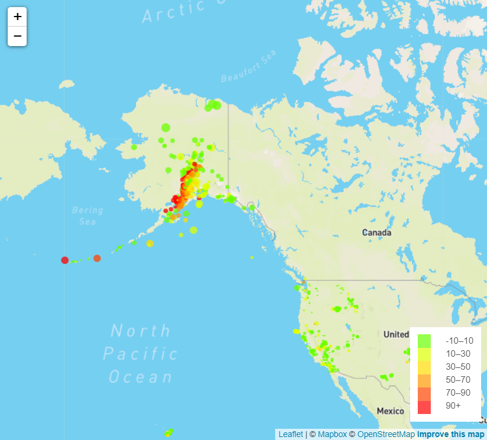

# leaflet-challenge
Plotting all Earthquakes from the last 7 days.
Radius and color are weighted by magnitude and depth respectively.

## Instructions
Create a file called conf.js and add the following:

const API_KEY = "Your API Key Here"

You will need to obtain your token from:
https://docs.mapbox.com/help/glossary/access-token/

## Visual Example:

